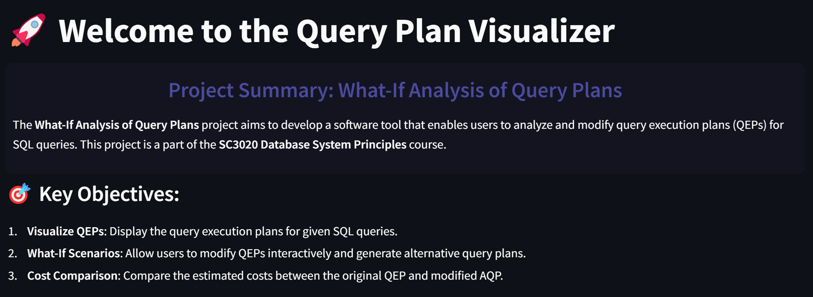
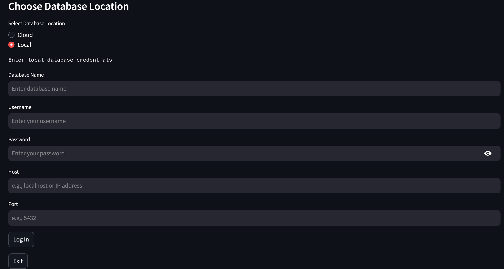
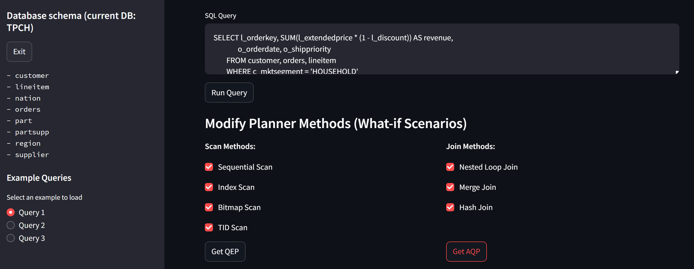
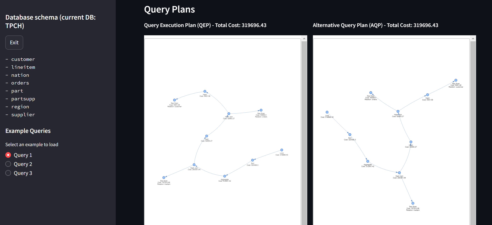
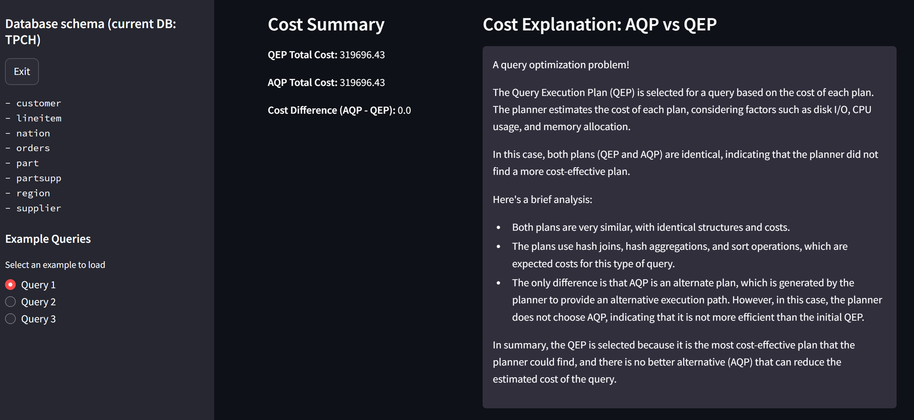
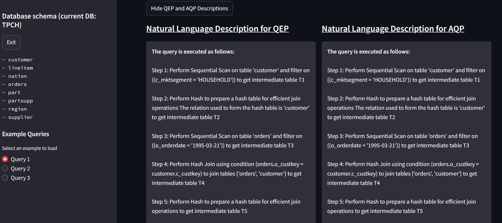

# What-If-Query-Plan
The What-If Analysis of Query Plans project aims to develop a software tool that enables users to analyze and modify query execution plans (QEPs) for SQL queries. This project is a part of the SC3020 Database System Principles course.

## Introduction Page

## Database Connection Page (Local and Cloud)

## Main Page

Query Plan Visualization:

Cost Comparison:

Description of the Query Plan:

## Team Members:
1. Ng Woon Yee
2. Tay Zhi Xian
3. Alex Khoo Shien How
4. Chua Ming Ru
5. Yang Yichen
